   

  

  
  

  

---

## 👋 Hi, I'm Anthony!

About Me

- I randomly find a project, or get frustrated at something, then get an idea 💡  
- I get obsessed for a month 😅  
- I rarely touch the project again afterward  
- Thanks for checking out my profile! 🙏

