  

  

- I'm anthony
- I'll randomly find a project or get frustrated at something and then get an idea
- I'll then get obsessed for a month
- And I'll proceed to never touch the project again
- Thanks for looking at my profile! 👋

Thanks to [Quicksilver151](https://github.com/Quicksilver151) for README inspiration!
